# DSO101 - Continuous Integration and Continuous Deployment

# Assignment 1 Report

---

## Step 0 – Prerequisite: Creating the To-Do List Web Application

Before deploying anything, a full-stack To-Do List application was built locally with three layers:

- **Frontend (FE):** A React-based UI where users can add, edit, and delete tasks.
- **Backend (BE):** A Node.js/Express server providing CRUD API endpoints.
- **Database (DB):** A PostgreSQL database for storing and persisting tasks.

Environment variables (`.env` files) were used throughout to keep credentials and configuration out of the codebase.

### What the App Looks Like

The screenshot below shows the working To-Do List app in the browser at `localhost:5173`. It displays existing tasks and allows the user to edit or delete them.

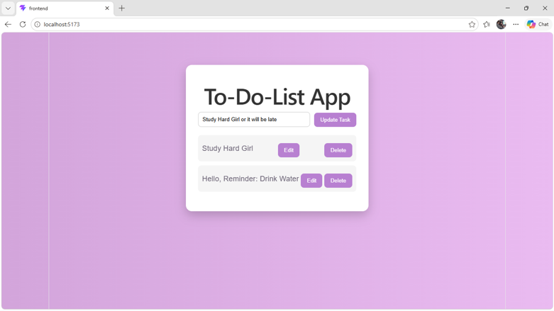
> *To-Do List App running locally at localhost:5173*

### Environment Variables (.env)

Environment variables separate sensitive configuration from code. Two `.env` files were created — one for the backend, one for the frontend.

**Backend `.env`**

```env
DB_HOST=localhost
DB_USER=postgres
DB_PASSWORD=your_password
DB_NAME=todolist
PORT=5000
```

**Frontend `.env`**

```env
REACT_APP_API_URL=http://localhost:5000
```
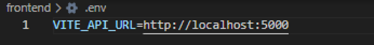

| Term | Explanation |
|---|---|
| `REACT_APP_` | Prefix required by Create React App to expose a variable to the browser |
| `API_URL` | The address the frontend uses to contact the backend API |
| `http://localhost:5000` | While running locally, the backend lives at port 5000 on the same machine |

> **Important:** The `.env` files were added to `.gitignore` so they are never committed to GitHub — credentials must stay private.

---

## Part A — Deploying a Pre-Built Docker Image to Docker Hub

Part A involves building Docker images for both the backend and frontend, pushing them to Docker Hub with the student ID as the tag, and then deploying those images on Render.com.

### Step 1: Docker Login

Before pushing images, authenticate with Docker Hub from the terminal:

```bash
docker login
```

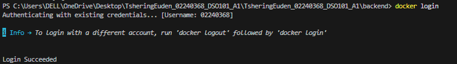

| Word | Explanation |
|---|---|
| `docker` | The Docker CLI tool installed on the machine |
| `login` | Command that authenticates the user with Docker Hub using saved credentials |

---

### Step 2: Build the Backend Docker Image

The backend Dockerfile defines how to containerize the Node.js server. The build command was:

```bash
docker build -t 02240368/be-todolist:02240368 .
```

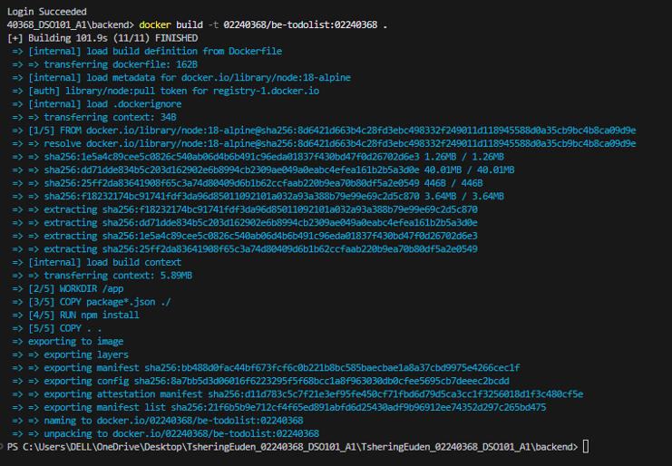

| Word / Option | Explanation |
|---|---|
| `docker build` | Tells Docker to build a new image from a Dockerfile |
| `-t` | Tag flag — assigns a name and tag to the image |
| `02240368/be-todolist` | The image name in the format `dockerhub-username/image-name` |
| `:02240368` | The tag (version label) — the student ID is used as required by the assignment |
| `.` | The build context — the current directory where Docker looks for the Dockerfile |

### The Backend Dockerfile Explained

```dockerfile
FROM node:20-alpine
WORKDIR /app
COPY package*.json ./
RUN npm install
COPY . .
EXPOSE 5000
CMD ["node", "server.js"]
```
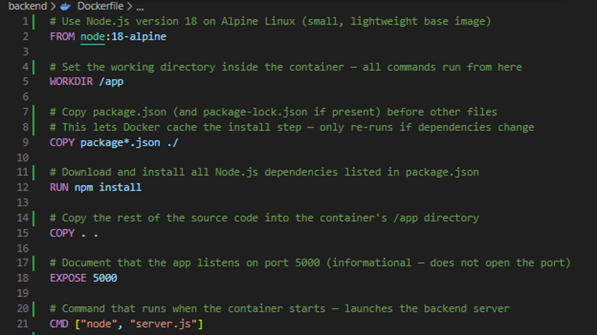
---

### Step 3: Push Backend Image to Docker Hub

```bash
docker push 02240368/be-todolist:02240368
```

#### Word by Word

| Word / Option | Explanation |
|---|---|
| `docker push` | Uploads the local image to Docker Hub |
| `02240368/be-todolist:02240368` | Specifies which image to push, including the tag |

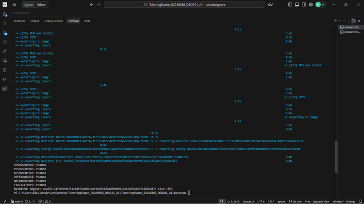
After pushing, each layer is uploaded and Docker Hub confirms with a digest (`sha256` hash) — proof that the image was stored successfully.

---

### Step 4: Build and Push Frontend Image

The same process was repeated for the frontend React app. The frontend Dockerfile uses `node:20-alpine` and exposes port `5173` (Vite dev server).

```bash
docker build -t 02240368/fe-todolist:02240368 .
docker push 02240368/fe-todolist:02240368
```
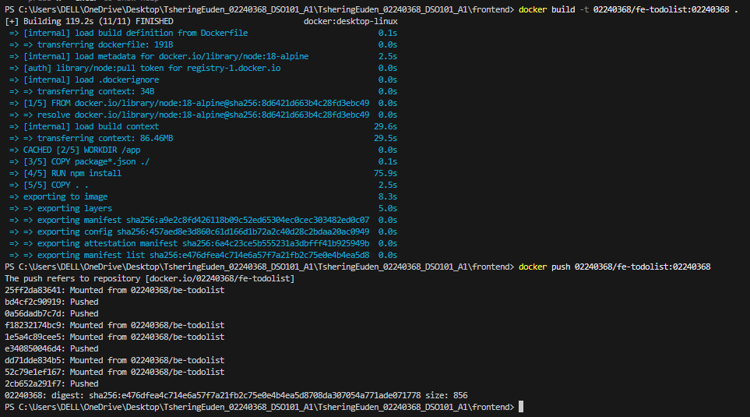
---

### Step 5: Verify Images on Docker Hub

After pushing, both images were verified on Docker Hub under the `02240368` namespace.
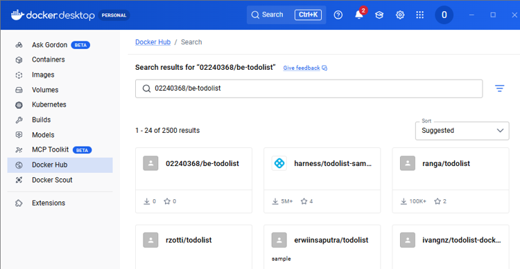

> *Both `be-todolist` and `fe-todolist` images visible on Docker Hub dashboard*

---

### Step 6: Deploy Backend on Render.com
Render.com was used to deploy both images as web services. On the Render dashboard, click **"+ New"** and select **"Web Service"**.
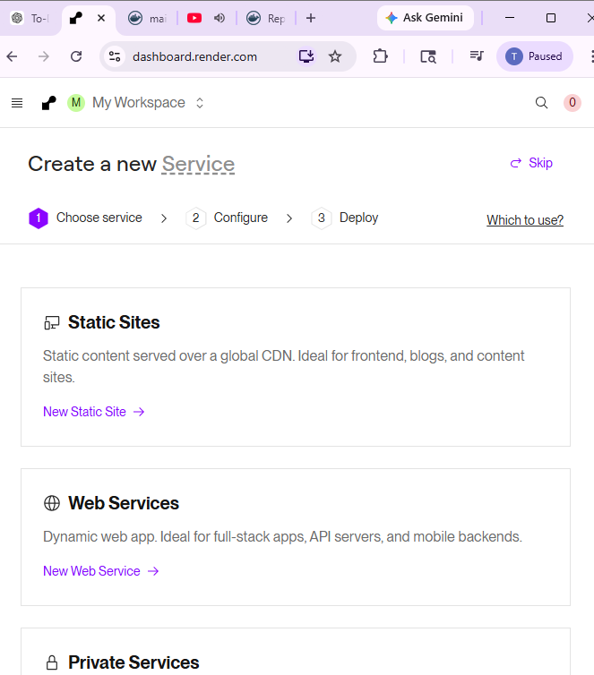
For the backend service, **"Existing Image from Docker Hub"** was selected as the source, and the image path was set to:

```
02240368/be-todolist:02240368
```

---

### Step 7: Set Up PostgreSQL Database on Render

The application needs a database. Render provides a managed PostgreSQL service.
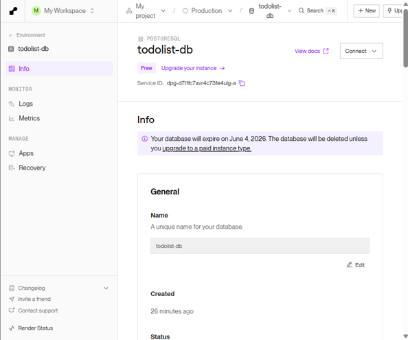
> *`todolist-db` dashboard on Render — database ready to connect*

---

### Step 8: Deploy Backend Web Service
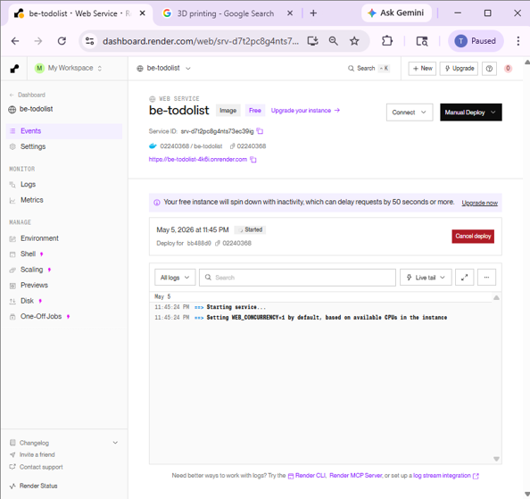
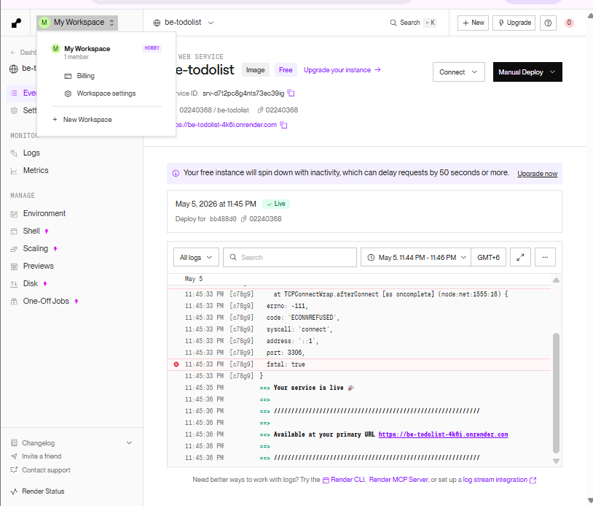
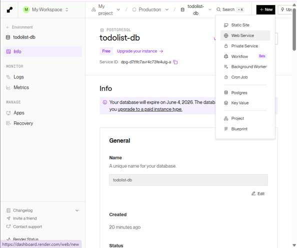
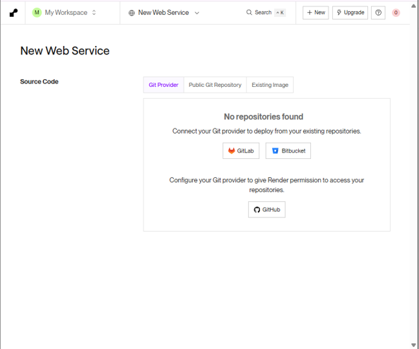
After the database was ready, the backend web service was deployed. Environment variables were added in the Render dashboard so the backend could connect to the database.

#### Key Environment Variables Set on Render

| Variable | Description |
|---|---|
| `DB_HOST` | The internal hostname of the Render PostgreSQL instance |
| `DB_USER` | Database username (auto-generated by Render) |
| `DB_PASSWORD` | Database password (auto-generated by Render) |
| `PORT=5000` | Port for the backend to listen on |

---

## Part B — Automated Image Build and Deployment (render.yaml Blueprint)

Part B automates the entire build and deploy pipeline. Instead of manually building Docker images and pushing them, Render watches the GitHub repository and automatically builds and deploys a new image every time a new commit is pushed.

### Repository Structure

The project was organized in the following folder structure as required by the assignment:

```
/TsheringEuden_02240368_DSO101_A1
  /frontend
    Dockerfile
    .env.production
  /backend
    Dockerfile
    .env.production
  render.yaml
```

Each folder has its own Dockerfile. The `render.yaml` file at the root is the blueprint that Render reads to know how to build and deploy all services together.

---

### The render.yaml File Explained

The `render.yaml` is like a recipe that tells Render: *"Build these services, using these Dockerfiles, with these environment variables."*
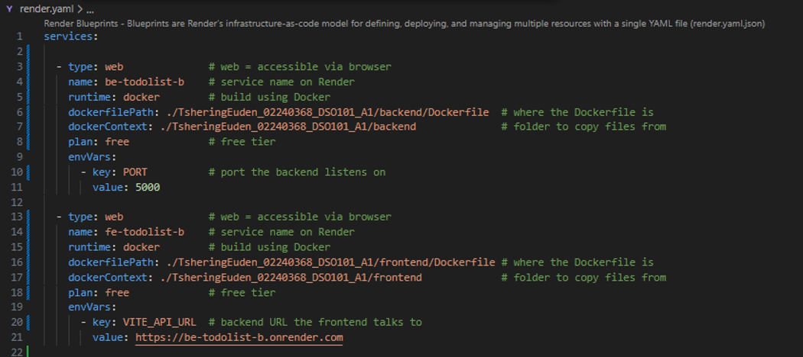

```yaml
services:
  - type: web
    name: be-todolist
    runtime: docker
    dockerfilePath: ./backend/Dockerfile
    dockerContext: ./backend
    envVars:
      - key: PORT
        value: 5000

  - type: web
    name: fe-todolist
    runtime: docker
    dockerfilePath: ./frontend/Dockerfile
    dockerContext: ./frontend
```

---

### Step 1: Connecting GitHub to Render

To enable auto-deploy on every push, Render needs access to the GitHub repository. This is done by installing the **Render GitHub App**.
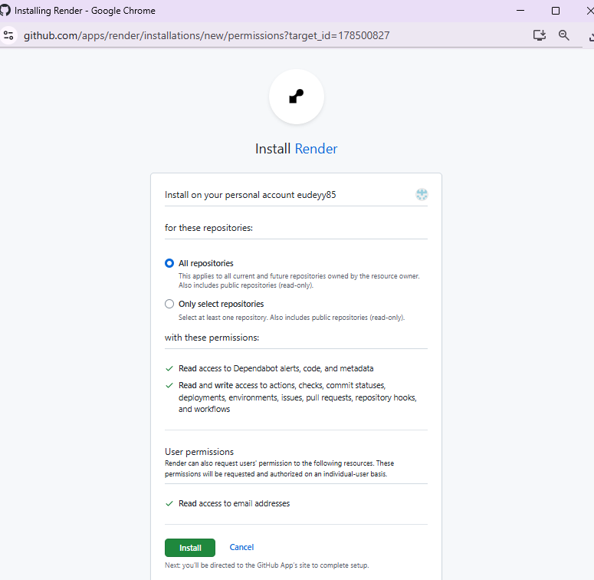
> *GitHub App installation page — granting Render permission to access repositories*

---

### Step 2: Creating a Blueprint from render.yaml

Once the repository is connected, a **Blueprint** is created in Render. A Blueprint reads the `render.yaml` and sets up all the services automatically.
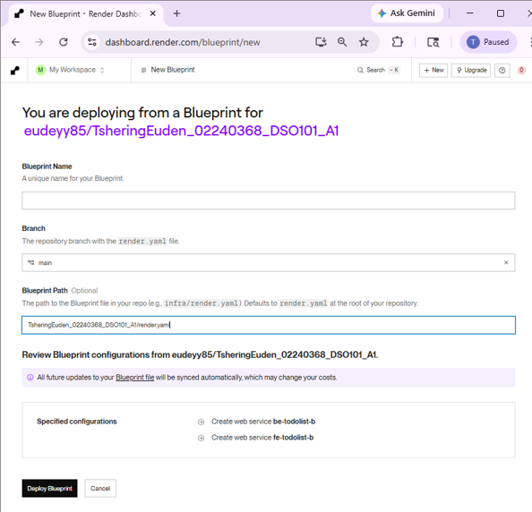
---

### Step 3: Troubleshooting — Deploy Failures

The first few deploys failed due to incorrect paths in `render.yaml`. This is a normal part of the process and was fixed iteratively.
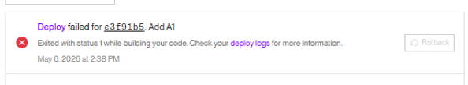
**The fix:** The `dockerfilePath` and `dockerContext` in `render.yaml` were updated to use the correct subfolder paths matching the actual repo structure.

#### Git Commands Used to Push the Fix

```bash
git add .
git commit -m "Fix render.yaml folder paths"
git push
```

#### Word by Word

| Command | Explanation |
|---|---|
| `git add .` | Stages all changed files (the updated `render.yaml`) for the next commit |
| `git commit -m "Fix render.yaml folder paths"` | Creates a snapshot of the changes — `-m` flag sets the commit message |
| `git push` | Uploads the commit to GitHub; because Render is watching this repo, it automatically triggers a new build |

---

### Step 4: Successful Deployment

After fixing the paths, the Blueprint deployed both services successfully. The auto-deploy pipeline was now active — every new `git push` triggers a rebuild and redeploy automatically.
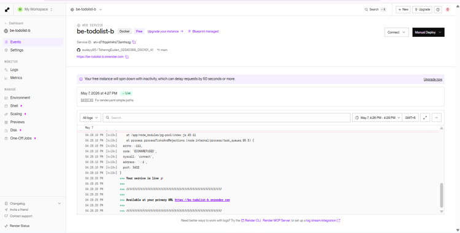
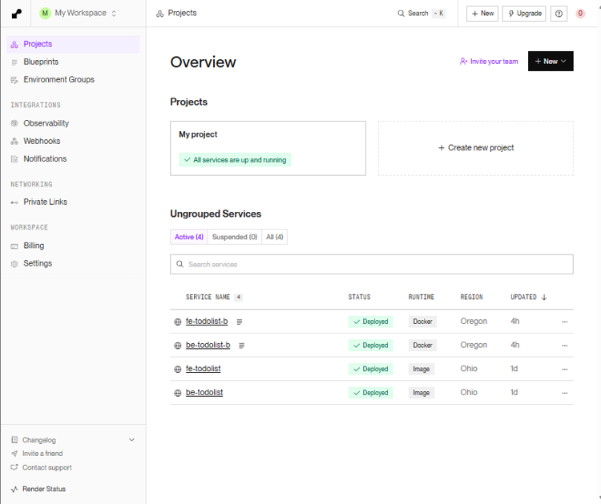
---

## Final Verification — Live Endpoints

Both deployments were verified live. The backend API was tested by visiting the `/tasks` endpoint.
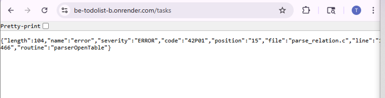
> *Backend API responding at the Render live URL*

The error shown (`code 42P01 - undefined_table`) means the backend is running and reaching the database, but the `tasks` table has not been created yet. This is expected for an initial deploy before running database migrations.


## Challenges Faced
- Environment variables had to be manually added on Render since .env is not committed.
- DB_HOST=localhost does not work on Render — server starts but database endpoints fail.


# Assignment 2: Jenkins CI/CD Pipeline — Practical Report

---

## 1. Introduction

This report documents the completion of Assignment 2 for DSO101 - DevSecOps Fundamentals. The objective was to set up Jenkins on a local machine and configure a CI/CD pipeline that automatically builds, tests, and deploys the To-Do List web application developed in Assignment 1.

The pipeline consists of the following automated stages:

- **Checkout** — Cloning the source code from GitHub.
- **Install** — Installing Node.js dependencies via `npm install`.
- **Build** — Building the application.
- **Test** — Running automated tests and publishing results.
- **Docker Build & Push** — Building a Docker image and pushing it to Docker Hub.

---

## 2. Jenkins Installation

### 2.1 Port Configuration

Jenkins was configured to run on port `8080`. The port was tested and confirmed available before proceeding with the installation.
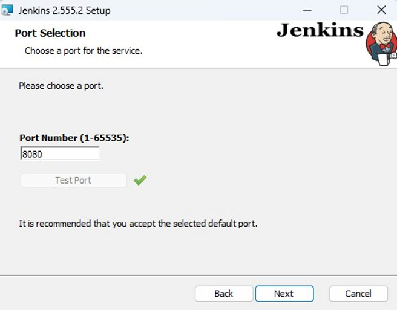

### 2.2 Installation Complete

Jenkins **2.555.2** was successfully installed on the local Windows machine. The Setup Wizard confirmed successful completion.
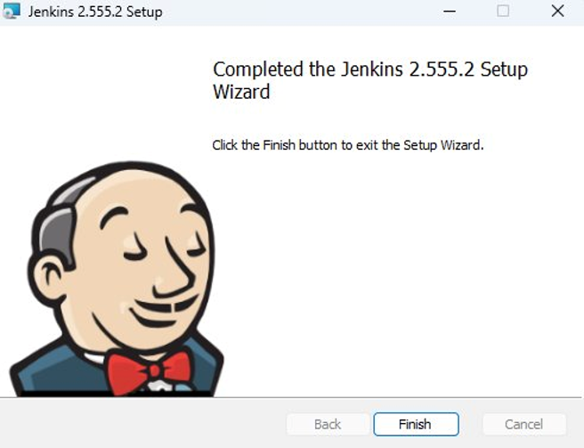
---

## 3. Jenkins Dashboard

After installation, Jenkins was accessed at `http://localhost:8080`. The dashboard shows the Pipeline project along with its build history and status.
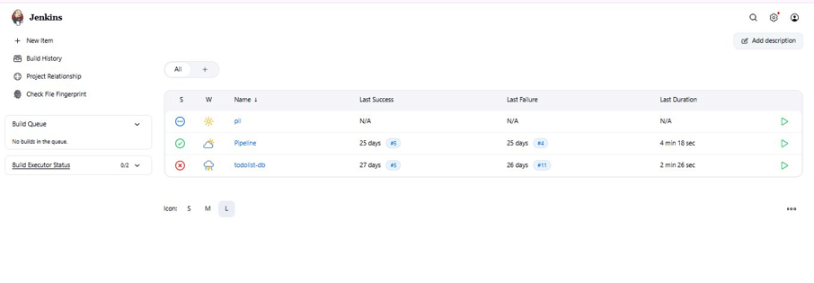
The Pipeline project shows a successful build history with multiple runs. **Build #5** is the latest successful build, completing in **4 minutes 18 seconds**.
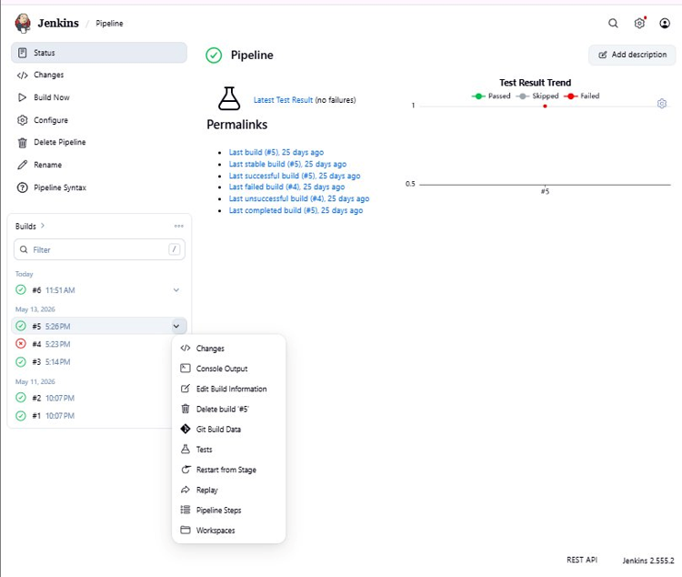

---

## 4. Pipeline Status and Configuration

The Jenkins Pipeline was configured to pull the `Jenkinsfile` directly from the GitHub repository. The pipeline status page shows the latest test results with no failures, confirming the pipeline is healthy.
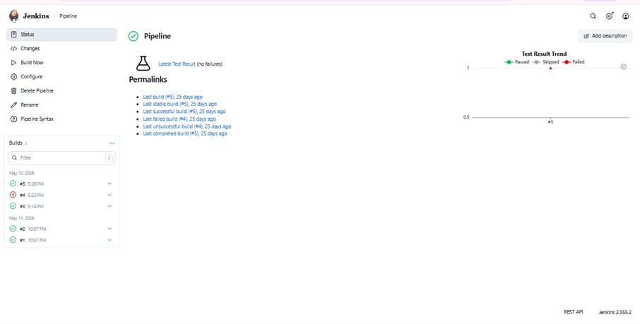

---

## 5. Pipeline Execution — Console Output

### 5.1 Pipeline Start — Checkout Stage

The console output confirms that Jenkins obtained the `Jenkinsfile` from the GitHub repository and successfully cloned the source code using the configured GitHub credentials (`github-creds`).
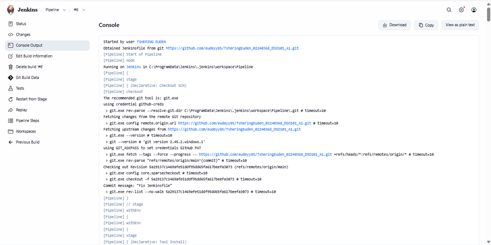

### 5.2 Pipeline Completion

The pipeline completed all stages successfully. The final console output confirms:

```
Pipeline completed successfully!
Finished: SUCCESS
```
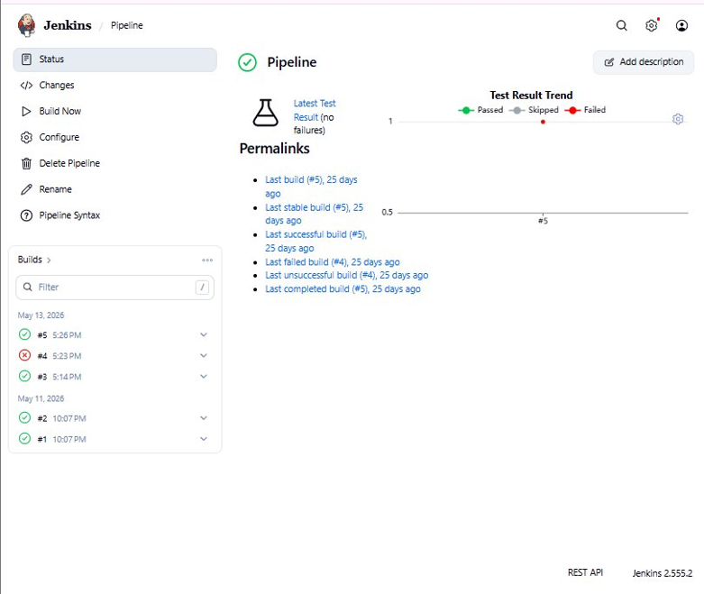
Docker image layers were also pushed to Docker Hub at this stage.

---

## 6. Test Results

The Test stage executed `npm test` against the backend application. Jenkins collected the JUnit test results from `backend/junit.xml`.
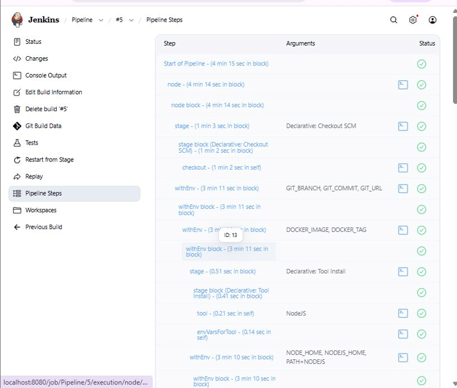
| Result  | Count |
|---------|-------|
| Passed  | 1     |
| Failed  | 0     |
| Skipped | 0     |

All tests passed successfully with zero failures.

---

## 7. Pipeline Steps Detail

### 7.1 Checkout and Tool Installation

The Pipeline Steps view shows every step executed during build #5. All steps completed successfully (green checkmarks). The Checkout SCM stage cloned the repository, and the NodeJS tool was automatically installed and configured.
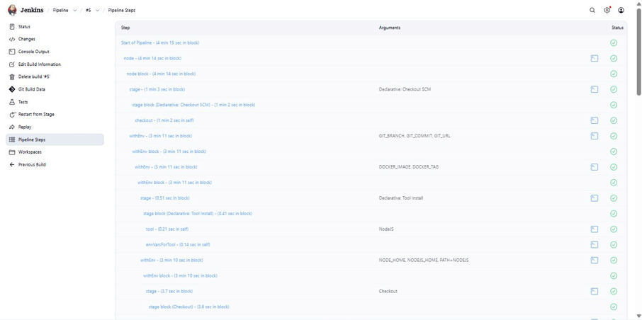

### 7.2 Install and Build Stages

The Install (`npm install`) and Build stages both completed successfully.
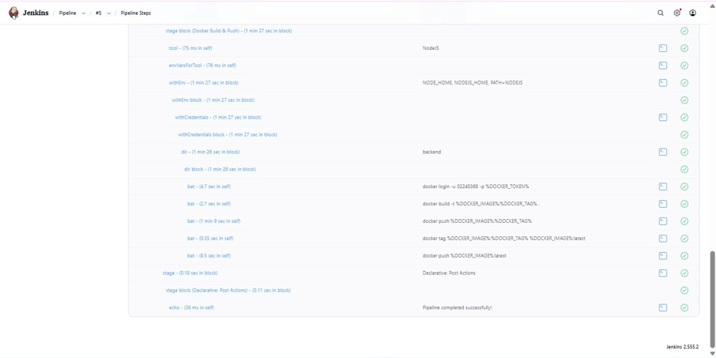

### 7.3 Docker Build & Push Stage

The Docker Build & Push stage executed five commands in sequence:
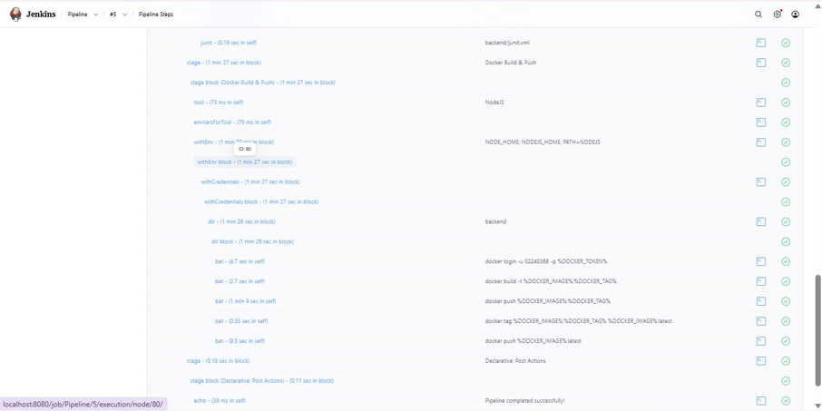
1. `docker login`
2. `docker build`
3. `docker push` (versioned tag)
4. `docker tag`
5. `docker push` (latest tag)

All steps completed successfully.

---

## 8. Docker Hub — Image Pushed by Jenkins

### 8.1 Docker Hub Repositories

The Docker Hub account (`02240368`) shows the `todo-app` repository was last pushed 26 days ago, corresponding to when the Jenkins pipeline ran successfully.
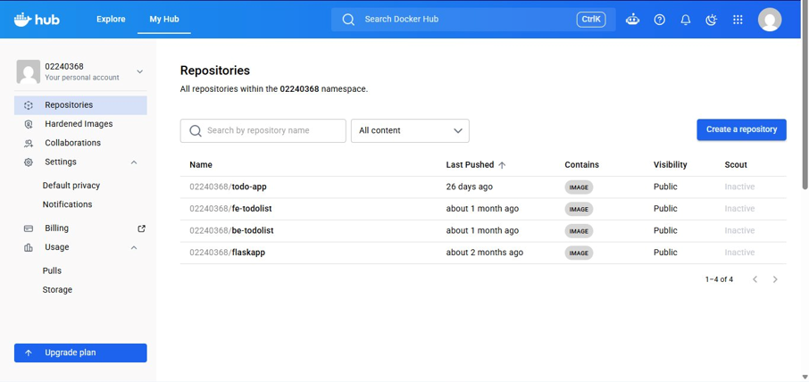

### 8.2 Docker Image Tags

The `todo-app` repository contains two tags:

| Tag      | Description                              |
|----------|------------------------------------------|
| `latest` | Most recent build                        |
| `5`      | Corresponds to Jenkins build #5 (`BUILD_NUMBER=5`) |

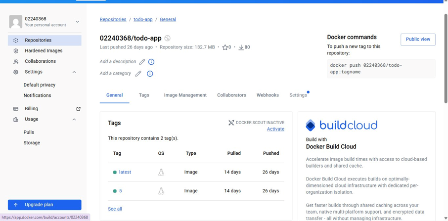
This confirms the image was pushed automatically by Jenkins.

---

## 9. Jenkinsfile in GitHub Repository

The `Jenkinsfile` is committed to the root of the GitHub repository (`TsheringEuden_02240368_DSO101_A1`). It defines all five pipeline stages:

1. Checkout
2. Install
3. Build
4. Test
5. Docker Build & Push
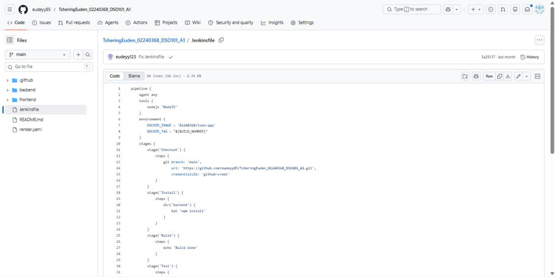

## Challenges Faced
- Jenkinsfile had a syntax error — post block was inside stages instead of outside.
- Directory paths were wrong and had to be changed from `TsheringEuden_02240368_DSO101_A1/backend` to just `backend`.
- Pipeline was initially using simple echo statements instead of the real Jenkinsfile from SCM.

# Assignment III – CI/CD Pipeline Report

---

## 1. Objective

This assignment involves setting up a complete CI/CD pipeline using GitHub Actions to automate building a Docker container, pushing it to DockerHub, and deploying it on Render.com — all triggered automatically whenever code is pushed to the `main` branch.

---

## 2. Tools & Technologies Used

| Tool | Purpose |
|---|---|
| GitHub | Hosts the source code repository. |
| GitHub Actions | Automates the CI/CD workflow. |
| Docker | Packages the application into a container. |
| DockerHub | Stores and shares Docker images. |
| Render.com | Cloud platform to deploy the container. |
| Node.js | Backend runtime environment. |

---

## 3. Task 1 – GitHub Repository Setup

### 3.1 Repository Structure

The GitHub repository `TsheringEuden_02240368_DSO101_A1` was confirmed as **public** so that DockerHub and Render.com can access the code without authentication issues.

```
TsheringEuden_02240368_DSO101_A1/
├── .github/workflows/deploy.yml   # GitHub Actions workflow file
├── backend/                       # Node.js backend with its Dockerfile
├── frontend/                      # React frontend with its Dockerfile
├── Jenkinsfile                    # Used for Assignment 2
├── README.md                      # Project documentation
└── render.yaml                    # Render deployment config
```

---

## 4. Task 2 – Docker Setup

### 4.1 Dockerfile

A `Dockerfile` was created inside the `backend/` folder defining how the container image is built.
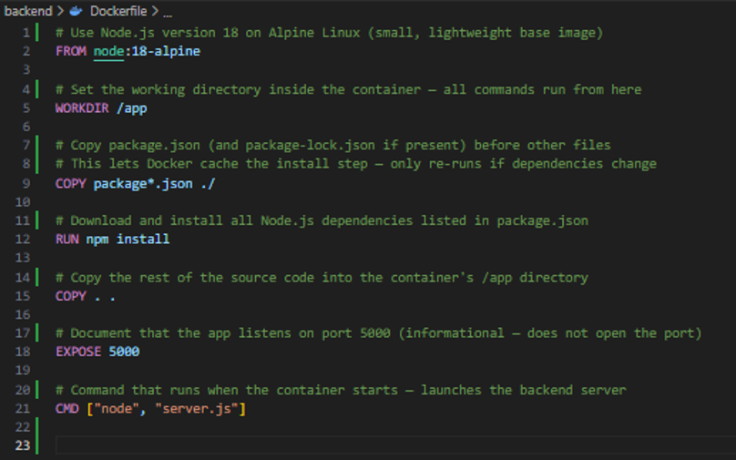

---

### 4.2 Local Docker Build & Push

Before setting up automation, the Docker image was built and pushed manually to verify it works:

```bash
docker build -t 02240368/todo-app:latest .
```
> Builds the Docker image from the Dockerfile and tags it as `02240368/todo-app:latest`. The format is `username/repo-name:version`.

```bash
docker login
```
> Logs into DockerHub using saved credentials (username: `02240368`).

```bash
docker push 02240368/todo-app:latest
```
> Uploads the built image to DockerHub. The terminal confirmed each layer was pushed and showed the final digest hash.

---

### 4.3 DockerHub Account & Token Setup

A **personal access token** was created on DockerHub to allow GitHub Actions to log in securely:

- Token name: `github-actions`
- Permissions: **Read, Write, Delete**
- Repository: `todo-app` — set to **Public** visibility

---

## 5. Task 3 – GitHub Actions Workflow

### 5.1 `deploy.yml` Pipeline Configuration

The workflow file at `.github/workflows/deploy.yml` defines the full CI/CD pipeline triggered on every push to `main`.
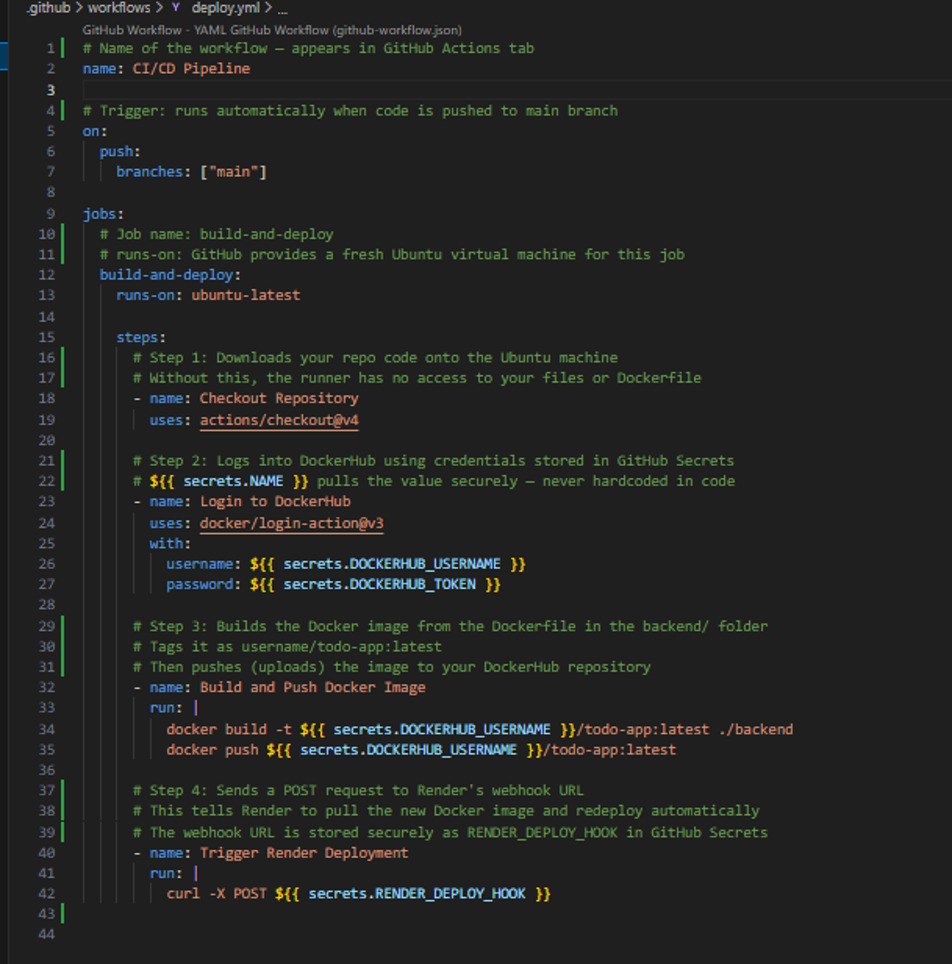

---

### 5.2 GitHub Secrets Added

Three secrets were added under **Settings → Secrets and Variables → Actions**:

| Secret Name | Value |
|---|---|
| `DOCKERHUB_USERNAME` | DockerHub username (`02240368`) |
| `DOCKERHUB_TOKEN` | DockerHub personal access token |
| `RENDER_DEPLOY_HOOK` | Render webhook URL to trigger redeployment |

---

### 5.3 Successful GitHub Actions Workflow Run
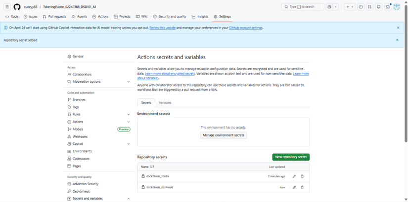
After pushing the commit `"Add GitHub Actions CI/CD workflow"` to `main`, the Actions tab showed a successful run:

- **Status:** ✅ Success
- **Duration:** 26 seconds
- **Trigger:** `deploy.yml` on push

**Steps completed:**
1. Checkout
2. Login to DockerHub
3. Build & Push
4. Trigger Render Deployment

---

## 6. Task 4 – Deployment on Render.com

### 6.1 Creating the Web Service

A new **Web Service** was created on Render.com using the **Existing Image** option:

- **Image URL:** `docker.io/02240368/todo-app:latest`
- **Service name:** `todo-app-a3`
- **Region:** Ohio
- **Instance type:** Free

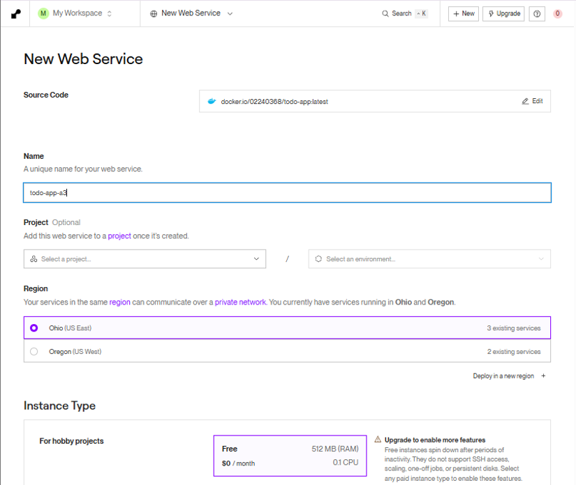
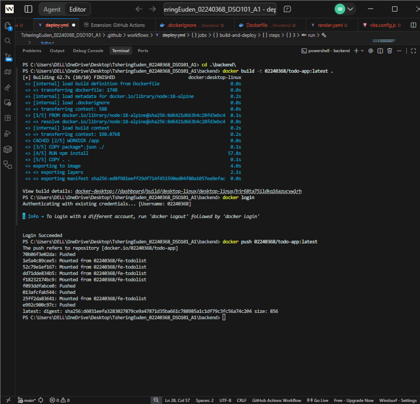
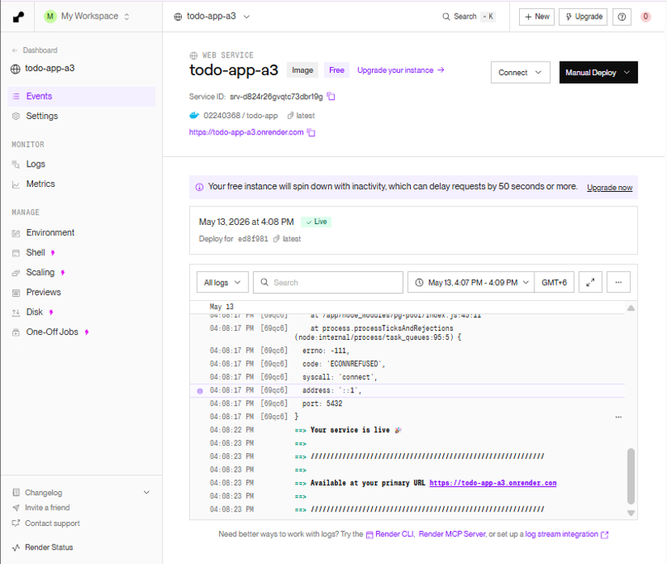


---

### 6.2 Environment Variables

Environment variables were added on Render matching the backend `.env` file:

| Variable | Description |
|---|---|
| `PORT` | Port the backend listens on |
| `DB_HOST` | Database host |
| `DB_USER` | Database username |
| `DB_PASSWORD` | Database password |
| `DB_NAME` | Database name |
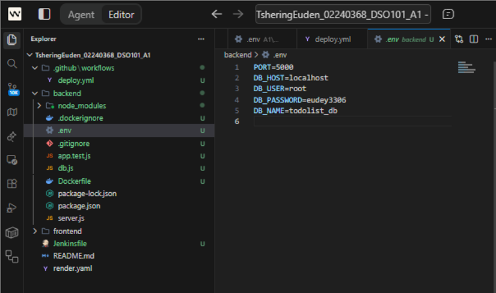


---

### 6.3 Deploy Hook Configuration

After the service was created, the **Deploy Hook URL** was copied from Render Settings and added as `RENDER_DEPLOY_HOOK` in GitHub Secrets. This connects GitHub Actions to Render so every push triggers an automatic redeployment.
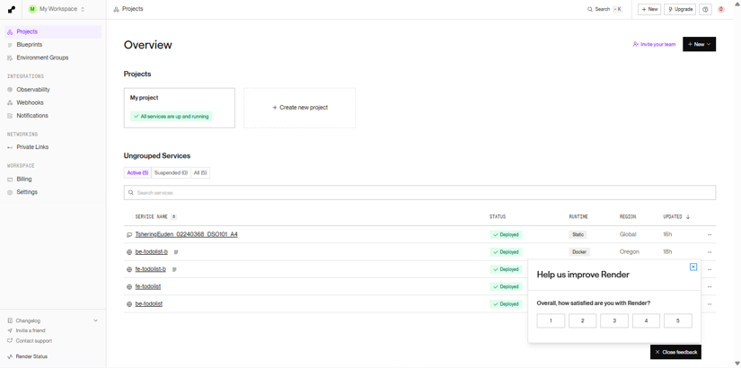

---

### 6.4 Live Deployment

The service was successfully deployed and went **Live on May 13, 2026 at 4:08 PM**:

- Render logs showed: `"Your service is live"`
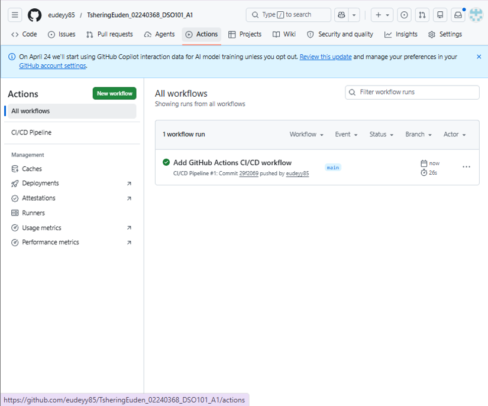
- Browser confirmed: `"Backend is working!"` at `todo-app-a3.onrender.com`

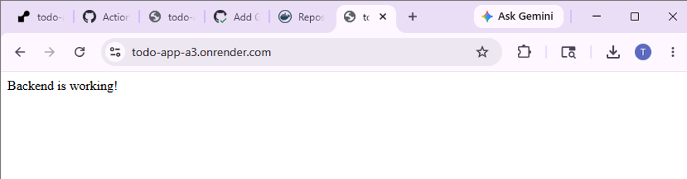

---

## 7. Challenges Faced

**1. DockerHub Image Visibility**
Initially the image was private, causing Render to show `"No public image found"`.
**Fix:** Set the DockerHub repository visibility to **Public**.

**2. Render Auto-Redeploy**
Render does not auto-redeploy when a new image is pushed to DockerHub.
**Fix:** Added a `curl -X POST` webhook step in the GitHub Actions workflow.

**3. Secret Naming**
The secrets in `deploy.yml` must exactly match the names in GitHub Settings. Any typo causes the workflow to fail.

**4. Failed Deployments**
The `be-todolist-b` and `fe-todolist-b` services showed `Failed deploy` from an older workflow.
**Fix:** Created a fresh `todo-app-a3` service, which worked correctly.

---

## 8. Deployment Links

| | Link |
|---|---|
| **Live Application** | https://todo-app-a3.onrender.com |
| **GitHub Repository** | https://github.com/eudeyy85/TsheringEuden_02240368_DSO101_A1 |


